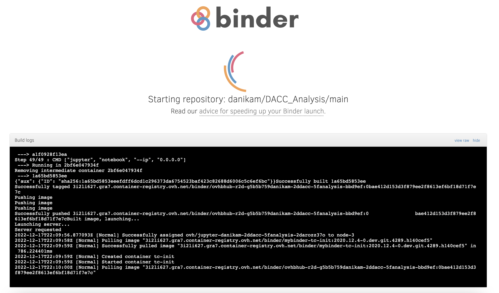

# DACC Optimization and Analysis

This optimization and analysis framework is designed to assist with tuning the settings of the UREC carbon capture device. The code runs in an interactive Jupyter python notebook. 

## Contact Info
In case of any questions, bug reports, or feature requests, don't hesitate to email the developer:
* Danika MacDonell (danika.m16@gmail.com)

## Description of files in this repository

* <b>Jupyter notebook: </b> The code, along with some documentation, is written in a python jupyter notebook [index.ipynb](./index.ipynb). 
* <b>Environment specs: </b> The python packages needed for the python notebook to run are specified in [environment.yml](./environment.yml). 

## Opening the python notebook

Click the following 'launch binder' icon to open the python notebook interactively on a binder server:

Please note that if the code in this repo has been updated since it was last opened on a binder server, it will need a few minutes to re-build before it can launch as an interactive notebook. Hang tight! In this case, the page will look something like this while it's re-building:

## Running the code in the python notebook

The code in the notebook can be executed interactively, one cell at a time. A given cell can be executed either by pressing the run button (▶) in the top panel, or by using the keyboard shortcut `Shift-Enter`. Just note that all cells prior to the given cell should have been executed at least once to ensure that the given cell will execute properly. 

You can also run all the cells in succession by clicking the 'Kernel' menu at the top, then selecting the 'Restart & Run All' option.

### Making changes on-the-fly

Users can make modifications to the code in the notebook hosted on the binder server and test these changes on-the-fly by re-running the cell. However, please note that any changes made to the notebook on binder will be lost once you end the binder session. 

Please contact Danika (danika.m16@gmail.com) to discuss options for modifying the code locally and pushing your changes to this github repo.

